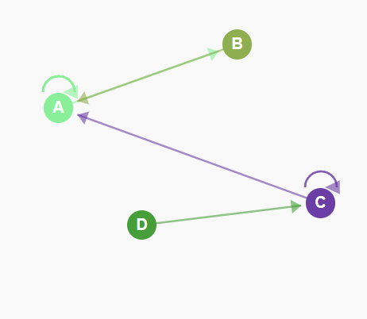
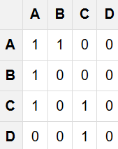
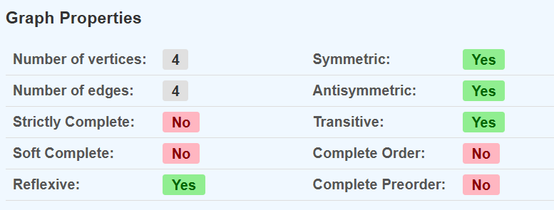
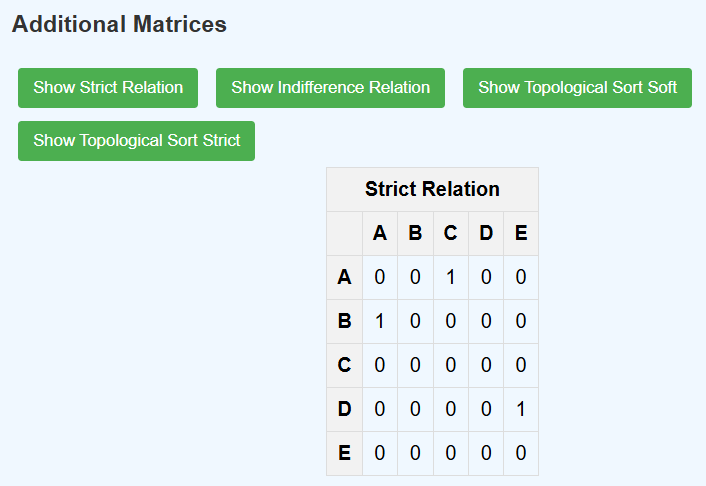

# Web Interface for Graph

This project is an initial attempt to display preference graph relationships for the Decision Modeling class at Centrale Supelec. It is a basic graphic interface that allows the user to create graphs in a webpage.
<!-- Images: Logo and Example Block Texture -->

<table>
	<tr>
		<td align="center">
			
		</td>
		<td align="center">
			
		</td>
	</tr>
	<tr>
		<td align="center"><strong>Exemple Graph</strong></td>
		<td align="center"><strong>Generated Matrix</strong></td>
	</tr>
</table>

## Graph analysis

### Tests
The application performs various mathematical tests on the directed graph to determine its properties:

- **Strictly Complete**: Checks if all possible directed edges exist between distinct vertices (excluding self-loops).
- **Soft Complete**: Checks if at least one directed edge exists between every pair of distinct vertices.
- **Reflexive**: Checks if all vertices have self-loops.
- **Symmetric**: Checks if the relation is symmetric (if a→b then b→a).
- **Antisymmetric**: Checks if the relation is antisymmetric (if a→b and b→a then a=b).
- **Transitive**: Checks if the relation is transitive (if a→b and b→c then a→c).
- **Complete Order**: Checks if the graph is a complete order (reflexive, antisymmetric, transitive, and complete).
- **Complete Preorder**: Checks if the graph is a complete preorder (reflexive, transitive, and complete).

### Returners
The application provides additional matrix computations and sorting functions:

- **Strict Relation**: Returns the asymmetric part of the adjacency matrix (edges where a→b but not b→a).
- **Indifference Relation**: Returns the symmetric part of the adjacency matrix (edges where both a→b and b→a exist).
- **Topological Sort Soft**: Returns a topological sort of the graph, handling indifference pairwise comparisons.
- **Topological Sort Strict**: Returns a topological sort where only strict pairwise comparisons exist.

	
	 
	<strong>Exemple Graph</strong>

 

	
	 
	<strong>Generated Matrix</strong>

## Contribution
1. Create a dedicated branch for each new feature or bug fix.
2. Commit your changes with clear and detailed messages.
3. Make sure to follow the project's [Git syntax](doc/gitSyntax.md).
4. Submit a pull request for review by another team member.

## Authors
- Samuel Chapuis

## License
This project is licensed under the MIT License.
You are free to use, modify, and distribute this software with proper attribution.

See [LICENSE](LICENSE) for details.

