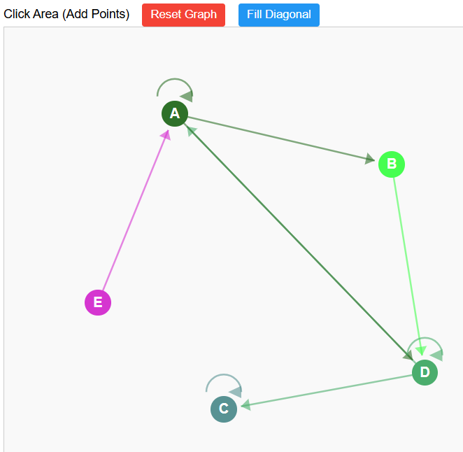
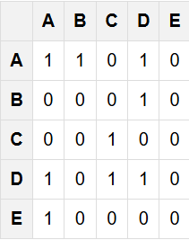

# Web Interface for Graph

This project is an initial attempt to display preference graph relationships for the Decision Modeling class at Centrale Supelec. It is a basic graphic interface that allows the user to create graphs in a webpage.
<!-- Images: Logo and Example Block Texture -->

<table>
	<tr>
		<td align="center">
			
		</td>
		<td align="center">
			
		</td>
	</tr>
	<tr>
		<td align="center"><strong>Exemple Graph</strong></td>
		<td align="center"><strong>Generated Matrix</strong></td>
	</tr>
</table>

## Contribution
1. Create a dedicated branch for each new feature or bug fix.
2. Commit your changes with clear and detailed messages.
3. Make sure to follow the project's [Git syntax](doc/gitSyntax.md).
4. Submit a pull request for review by another team member.

## Authors
- Samuel Chapuis

## License
This project is licensed under the MIT License.
You are free to use, modify, and distribute this software with proper attribution.

See [LICENSE](LICENSE) for details.

